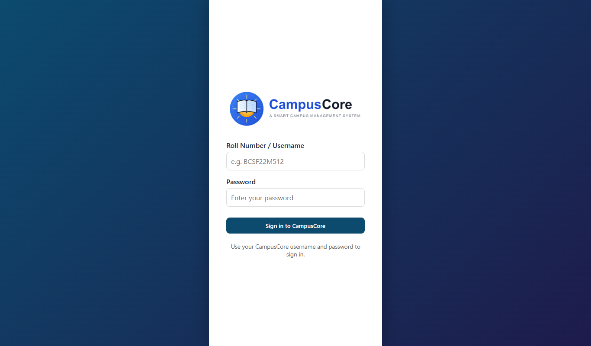
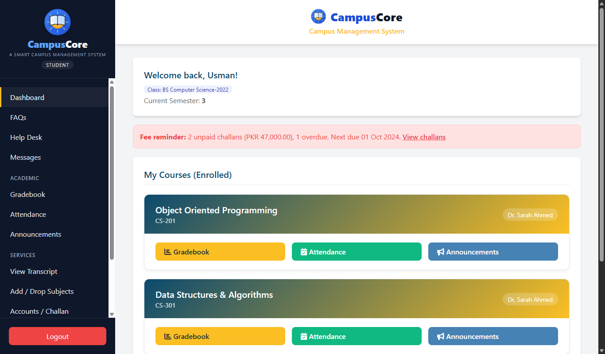
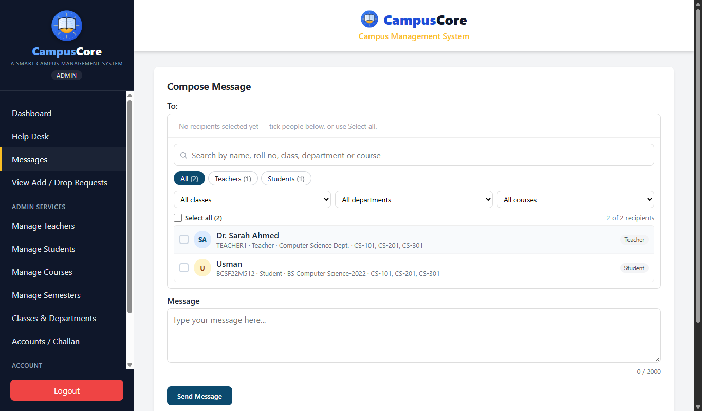
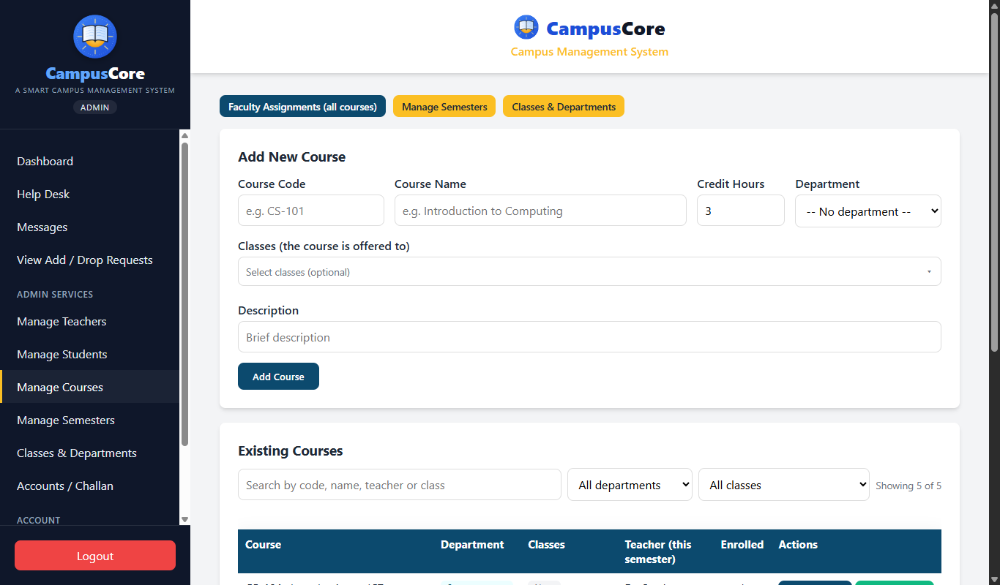
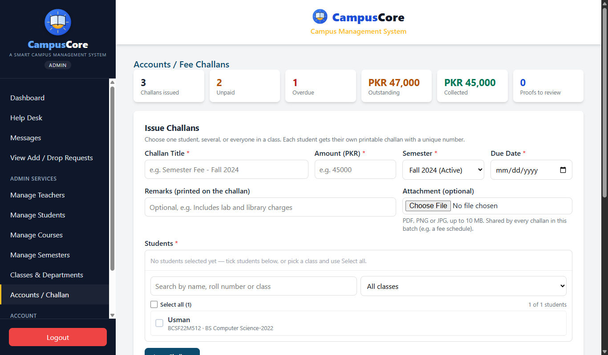
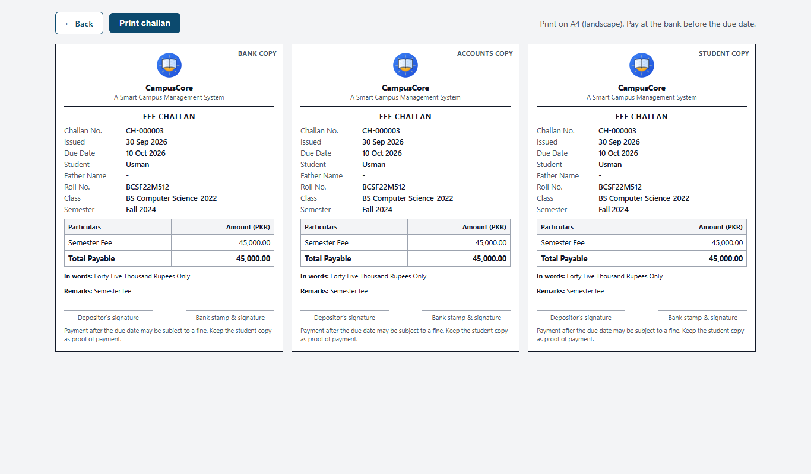

<p align="center">
  
</p>

# CampusCore

**A Smart Campus Management System**

CampusCore is a web portal for students, teachers and administrators: courses and enrollment, attendance, grades and transcripts, add/drop requests, fee challans, messaging and a help desk. It is built with Java (Jakarta Servlets + JSP) and MySQL, following an MVC structure.

## Screenshots

| | |
|---|---|
|  **Login** |  **Student dashboard** |
|  **Messages**: recipient search, filters and multi-select |  **Courses**: department and classes per course |
|  **Fee challans**: issue to many students at once |  **Printable voucher**: bank, accounts and student copies |

## Features

### Students
- **Dashboard** with current courses, class and a fee reminder for unpaid challans.
- **Gradebook, Attendance, Announcements and Transcript** (semester-wise GPA and CGPA).
- **Add / Drop / Withdraw** requests for courses offered in the active semester.
- **Fee challans**: view and print (bank, accounts and student copies) and upload proof of payment.
- **Messages** to teachers and the admin, and a **Help Desk** for support tickets.
- **Profile and password** management (name and roll number are admin-managed).

### Teachers
- **Course list** for their assigned courses, with each student's class.
- **Mark attendance**, **upload and publish grades**, and post **course announcements**.
- **Messages** to their students and the admin.

### Administrators
- **Students and teachers**: add, edit, activate/deactivate, and delete accounts that have no academic records.
- **Classes and departments**, e.g. class *BS Computer Science-2026* and department *Computer Science*.
- **Courses**: department, the classes a course is offered to, and credit hours.
- **Semesters**: add, edit, activate/deactivate and remove.
- **Faculty assignment**: assign a teacher to a course in a semester; the course's own department is listed first.
- **Enrollment**: enroll one, several or all matching students at once.
- **Add/drop requests**: approve or reject; the enrollment is updated in the same step.
- **Fee challans**: issue to many students at once, review payment proofs, and mark challans paid or unpaid.
- **Messages** (including broadcasts) and **Help Desk** replies.

## Technology

| Layer | Used |
|---|---|
| Language / runtime | Java 17 |
| Web | Jakarta Servlet 6 / JSP (Apache Tomcat 10.1) |
| Database | MySQL 8 (JDBC, `mysql-connector-j`) |
| Build | Maven (`pom.xml`), tests with JUnit 5 |
| Front end | HTML, CSS and plain JavaScript (no framework) |

## Getting started

### 1. Database
**Fresh install**: create the `cms_ead` database with sample data.
```bash
mysql -u root -p < database_schema.sql
```
**Existing database** from an earlier version: run the migrations in order instead (each one runs once).
```bash
mysql -u root -p cms_ead < database_migrations/001_classes_departments.sql
mysql -u root -p cms_ead < database_migrations/002_course_department_classes.sql
mysql -u root -p cms_ead < database_migrations/003_challan_details.sql
mysql -u root -p cms_ead < database_migrations/004_challan_payment_proof.sql
```
Passwords saved in plain text by an earlier version are hashed automatically the first time the application starts; users keep the same passwords.

### 2. Configuration
- **Database login**: set these environment variables (or `-D` JVM options with the same names) before starting Tomcat. The defaults suit a local development MySQL only.

  | Variable | Default |
  |---|---|
  | `CMS_DB_URL` | `jdbc:mysql://localhost:3306/cms_ead?useSSL=false&connectionTimeZone=LOCAL` |
  | `CMS_DB_USER` | `root` |
  | `CMS_DB_PASSWORD` | `root` |

- **Time zone**: the default URL uses the local time zone, which is correct when MySQL runs on the same machine as Tomcat. If MySQL runs elsewhere, set its zone in `CMS_DB_URL`, e.g. `connectionTimeZone=Asia/Karachi`.
- **Uploads** (challan attachments and payment proofs) are stored **outside** the web app, in `cms-uploads` under Tomcat's folder, so they survive redeploys. To use another folder, start Tomcat with `-Dcms.upload.dir=<folder>` or set the environment variable `CMS_UPLOAD_DIR`.

### 3. Build and run
Requires JDK 17 and Apache Tomcat 10.1.
```bash
mvn package
```
Copy `target/campuscore.war` into Tomcat's `webapps` folder and open
`http://localhost:8080/campuscore/`.

### Sample accounts (from `database_schema.sql`)
| Role | Username | Password |
|---|---|---|
| Admin | `ADMIN` | `ADMIN123` |
| Teacher | `TEACHER1` | `Teacher123` |
| Student | `BCSF22M512` | `Usman123` |

The schema stores these as hashes. Change them on any system other than a local development machine.

## Project structure
```
src/main/java/com/cms/
  controllers/   Servlets (one per page / action)
  dao/           Database access (JDBC)
  models/        Plain data classes
  filters/       Login and role checks
  listeners/     Start-up tasks (hashing old plain-text passwords)
  util/          Password hashing, HTML escaping, upload storage
src/main/webapp/
  *.jsp          Pages
  css/, js/      Styles and scripts
  images/        CampusCore logo (campuscore-logo.png), icon (campuscore-icon*.png)
  WEB-INF/web.xml  Servlet mappings
database_schema.sql      Full schema + sample data
database_migrations/     Upgrades for existing databases
src/test/java/           JUnit tests
docs/screenshots/        Images used in this README
```

## Security
- **Passwords** are hashed with PBKDF2-HMAC-SHA256 (600,000 iterations, a random 16-byte salt per password) using only the JDK. Hashes are compared in constant time, and a login with an unknown username takes as long as one with a wrong password. Each hash stores its iteration count, so the count can be raised later; older hashes are upgraded when the user next logs in. To create a hash by hand, e.g. for seed data:
  ```bash
  java -cp target/classes com.cms.util.PasswordHasher <password>
  ```
- **Database credentials** come from environment variables, not the source code.
- **SQL** uses prepared statements throughout.
- **Access control**: every admin action checks the admin role on the server, not only in the menu.
- **Output**: pages escape user-entered text.
- **Uploads** are checked by content (PDF, PNG and JPG only, up to 10 MB), stored outside the web app, and served only to their owner and the admin.
